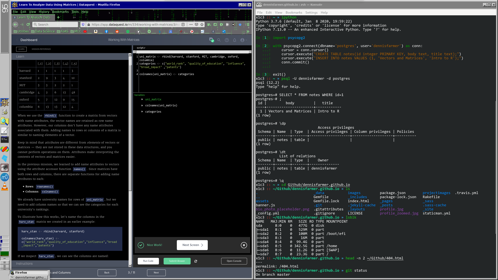
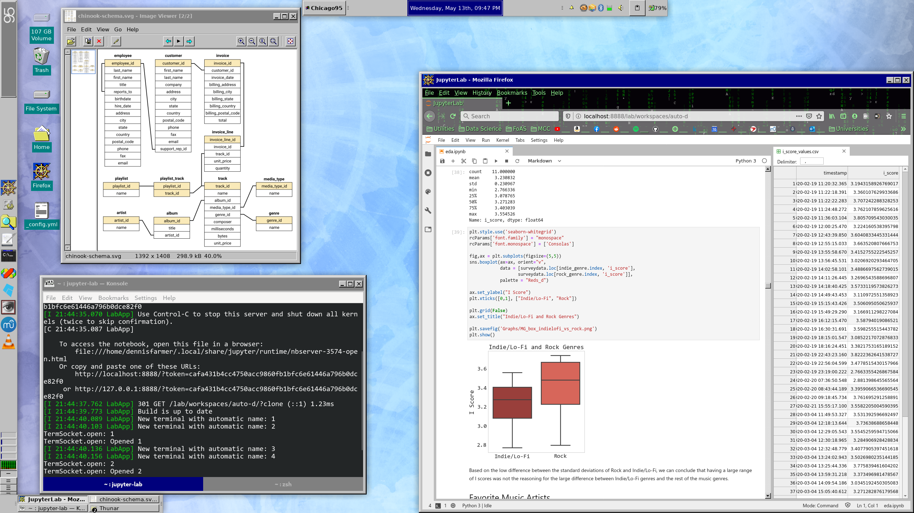
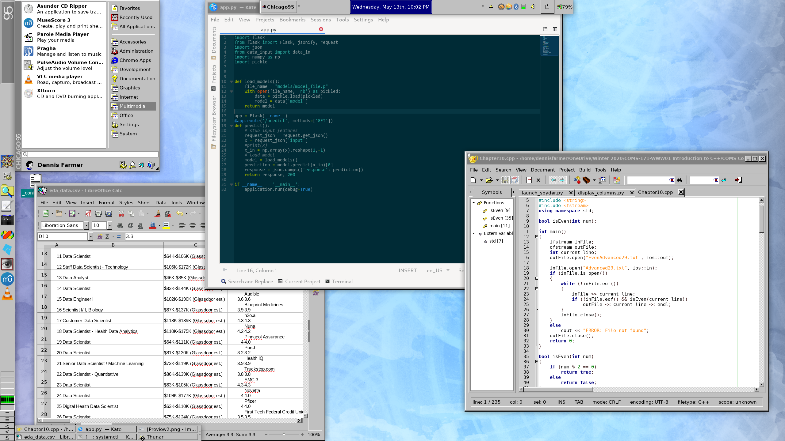

# My Dotfiles (System Configuration)
<hr>
These are configuration files for my different linux enviroments. Old-Arch-Setup contains a KDE+i3wm setup that I used to use before switching to my current XFCE with Chicago95 setup.

# Setup Summary
I'll write this later, no one's going to read this anyways, its just for my organization

# Screensaver:

- Drift


<br>
<hr>

# Programs:
|                 |                      |
|:----------------|---------------------:|
|IDE:             | Jupiter Lab          |
|Text Editors:    | Kate, Spyder, VS Code|
|PDF Viewer:      | Okular               |
|Terminal:        | Konsole              |
|File Explorer:   | Thunar               |
|Image Program:   | GIMP                 |
|Media Player:    | VLC                  |
|Web Browser:     | Firefox              |


# Terminal Programs:

|                 |         |
|:----------------|--------:|
|Bluelight Filter:| Redshift|
|Cloud Storage:   | Onedrive|
|Text Editor:     | Vim     |


<br>
<hr>

# Install Guides

- **Install Vundle**

    ```
    git clone https://github.com/VundleVim/Vundle.vim.git ~/.vim/bundle/Vundle.vim
    vim +PluginInstall +qall OR launch vim and run :PluginInstall
    ```
    `:PluginList`       - lists configured plugins

    `:PluginInstall`    - installs plugins; append `!` to update or just :PluginUpdate

    `:PluginSearch foo` - searches for foo; append `!` to refresh local cache

    `:PluginClean`      - confirms removal of unused plugins; append `!` to auto-approve removal

- **Install ohmyzsh**

    ```
    sh -c "$(wget https://raw.github.com/ohmyzsh/ohmyzsh/master/tools/install.sh -O -)"
    ```
- **Install zsh-syntax-highlighting**

    ```
    git clone https://github.com/zsh-users/zsh-syntax-highlighting.git \ 
    ${ZSH_CUSTOM:-~/.oh-my-zsh/custom}/plugins/zsh-syntax-highlighting
    ```

- **Install Powerline**

    ```
    pip install powerline-status
    pip show powerline-status
        "Location: /home/dennisfarmer/anaconda3/lib/python3.7/site-packages"
    

    ```

- **Install Fonts**

    ```
    cd ~/.local/share/fonts
    sudo mkfontscale && mkfontdir
    xset +fp ~/.local/share/fonts   #(xset q to list fontpaths)
    
    #(copy fonts to ~/.local/share/fonts)
    wget https://github.com/powerline/powerline/raw/develop/font/PowerlineSymbols.otf ~/.local/share/fonts/
    wget https://github.com/powerline/powerline/raw/develop/font/10-powerline-symbols.conf /etc/fonts/conf.d/
    fc-cache -f ~/.local/share/fonts

    ```

- **Enable Beefy Miracle Boot Theme**
    
    


    ```
    sudo dnf install plymouth-theme-hot-dog
    sudo plymouth-set-default-theme hot-dog -R
    ```
    


<br>
<hr>
    
    
    
# SQL:

- **Install Postgres Python Library**

    ```
    conda install psycopg2
    ```
    
- **Edit** `pg_hba.conf` **to Change Authentication Method**

    ```
    locate pg_hba.conf
    sudo vim /var/lib/pgsql/12/data/pg_hba.conf
    sudo systemctl restart postgresql-12
    ```
    
    - _Avaliable Methods:_
        - **trust** (use this one for easy login)
        - peer
        - md5
    
    
    
# Error Troubleshooting

- **DNF Error: DB_VERSION_MISMATCH**

    _If the above error occurs while installing a package, run the following:_

    ```
    rm -f /var/lib/rpm/__db*
    dnf update
    ```

- **Ruby Jekyll Installation Error**

    - _Error:_

    ```
    gcc: error: /usr/lib/rpm/redhat/redhat-hardened-cc1: No such file or directory
    ```
    - _Solution:_

    ```
    sudo dnf install redhat-rpm-config
    ```

- **Github Pages 404**

    - _Recommit the repo:_

    ```
    git commit --allow-empty -m "Trigger rebuild"
    ```

    
# Sample Images:






