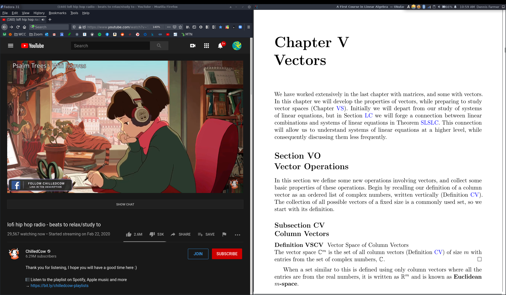

# My Dotfiles (System Configuration)
<hr>

As you may see, I am a wannabe apple dark-mode fanboy who happens to prefer thinkpads over macbooks. I plan to dualboot/hackintosh my x230 once it comes back from china (1080p 13.3" mod 😎) but at the moment I'm still rocking Fedora Linux.

### X1 Carbon 3rd Gen (1440p):




# Setup Summary
These are configuration files for my multiple Linux configurations. Old-Arch-Setup contains a KDE+i3wm setup that I used to use before switching to my current XFCE setup. `xfce-panel-profiles` contains XFCE settings for my `Macintosh 98` (current) and `Windows 98` setups.

This repo basically serves as a way to preserve the countless hours I've spent meticulously customizing my nerd computer setup, as well as a sort of art project to ~~flex on the normies~~ show off my sorta-artistic skills with (I do have a life, thanks for asking 😂). I have file sparsely organized, but for the most part I use my `copyconfig` script to organize my config directories.

My current setup utilizes the XFCE desktop manager, which is the lightest and most customizable DE I can find that allows for free-floating windows. I can tile my windows using keybinds within XFCE settings, but I plan on switching to a full tiling DE (bspwm) once I get a break from school to "work on" my Linux config again. KDE is my favorite overall, but XFCE sits at a really nice sweet spot between a "modern-like" and "tiling-and-slim" desktop manager so I'm currently messing with it.

`Arc-Dark` is my theme for my window manager, and I am currently using `Breeze Dark` for my icons. `Chicago95` is hella sexually appealing, but I used it for a super long time and sorta got sick of it. Basically, dark mode is for the 😎 uber 😎 cool 😎 kids 😎 and Arc-Dark + Breeze Dark matches the rest of my dark setup better than Chicago95's retro 90's-ness anyways.

For my terminal, I utilize the all-holy trinity (`Vim`, `Zsh`, and `Tmux` for the unenlightened). `Kate` is likely my second favorite text editor for quick edits, while `Spyder` and `VS Code` are my go-tos for more elaborate programming outside of the terminal. I like `Konsole` as my terminal program solely because I came from KDE and like to use KDE applications (they're all virtually identical anyhow, but KDE apps [konsole,kate] are total ass to write colorschemes for so I might switch later lol). My PDF viewer is `Okular` since it allows me to hide all of the annoying toolbars and such, and for my bluelight filter I use `Redshift` for the ability to quickly run it in a seperate tmux window within a few keypresses.

<br>
<hr>

# Screensaver:

- (xscreensaver) XMatrix

# Programs:
|                 |                      |
|:----------------|---------------------:|
|IDE:             | Jupiter Lab          |
|Text Editors:    | Kate, Spyder, VS Code|
|PDF Viewer:      | Okular               |
|Terminal:        | Konsole              |
|File Explorer:   | Thunar               |
|Image Program:   | GIMP                 |
|Media Player:    | VLC                  |
|Web Browser:     | Firefox              |


# Terminal Programs:

|                 |         |
|:----------------|--------:|
|Bluelight Filter:| Redshift|
|Cloud Storage:   | Onedrive|
|Text Editor:     | Vim     |

<br>
<hr>

# Install Guides

- **Install Anaconda**
 
  Go to `https://www.anaconda.com/products/individual#linux`

  Click 64-Bit (x86) Installer under "Linux"
 
  Run: `bash ~/Downloads/Anaconda3 ... -Linux-x86_64.sh`

- **Install Vundle**

    ```
    git clone https://github.com/VundleVim/Vundle.vim.git ~/.vim/bundle/Vundle.vim
    vim +PluginInstall +qall OR launch vim and run :PluginInstall
    ```
    `:PluginList`       - lists configured plugins

    `:PluginInstall`    - installs plugins; append `!` to update or just :PluginUpdate

    `:PluginSearch foo` - searches for foo; append `!` to refresh local cache

    `:PluginClean`      - confirms removal of unused plugins; append `!` to auto-approve removal

- **Install ohmyzsh**

    ```
    sh -c "$(wget https://raw.github.com/ohmyzsh/ohmyzsh/master/tools/install.sh -O -)"
    ```
- **Install zsh-syntax-highlighting**

    ```
    git clone https://github.com/zsh-users/zsh-syntax-highlighting.git ${ZSH_CUSTOM:-~/.oh-my-zsh/custom}/plugins/zsh-syntax-highlighting
    ```

- **Install zsh-autosuggestions**
    ```
    git clone https://github.com/zsh-users/zsh-autosuggestions ${ZSH_CUSTOM:-~/.oh-my-zsh/custom}/plugins/zsh-autosuggestions
    ```

- **Install Powerline**

    ```
    pip install powerline-status
    pip show powerline-status
        "Location: /home/dennisfarmer/anaconda3/lib/python3.8/site-packages"
   ``` 

    Add the following to your `tmuxrc`:
    
    ```
    # Powerline
    source $HOME/anaconda3/lib/python3.8/site-packages/powerline/bindings/tmux/powerline.conf
    ```

- **Install Fonts**

    ```
    cd ~/.local/share/fonts
    sudo mkfontscale && mkfontdir
    xset +fp ~/.local/share/fonts   #(xset q to list fontpaths)
    
    #(copy fonts to ~/.local/share/fonts)
    wget https://github.com/powerline/powerline/raw/develop/font/PowerlineSymbols.otf ~/.local/share/fonts/
    wget https://github.com/powerline/powerline/raw/develop/font/10-powerline-symbols.conf /etc/fonts/conf.d/
    fc-cache -f ~/.local/share/fonts

    ```

-  **Enable Rpmfusion Repositories**
    
    ```
    sudo dnf install https://download1.rpmfusion.org/free/fedora/rpmfusion-free-release-$(rpm -E %fedora).noarch.rpm https://download1.rpmfusion.org/nonfree/fedora/rpmfusion-nonfree-release-$(rpm -E %fedora).noarch.rpm
    ```

- **Enable Beefy Miracle Boot Theme**
    
    


    ```
    sudo dnf install plymouth-theme-hot-dog
    sudo plymouth-set-default-theme hot-dog -R
    ```
    


<br>
<hr>
   
# Set Custom Screen Resolution

_Useful for when the really expensive 1440p screen on your X1 Carbon breaks internally at the far edges and you're too poor to buy a Macbook Pro:_

```zsh
cvt 2464 1440
```

Output: `Modeline "2464x1440_60.00" 299.25 2464 ... [a bunch of numbers] ... -hsync +vsync`

```zsh
xrandr --newmode "2464x1440_60.00" 299.25 2464 2640 2904 3344 1440 1443 1453 1493 -hsync +vsync
xrandr --listmonitors # ... eDP-1
xrandr --addmode eDP-1 "2464x1440_60.00"
xrandr --output eDP-1 --mode "2464x1440_60.00"
```

# Find Files

```
sudo updatedb
locate [...]
```    

# Update Anaconda

```
conda update -n base -c defaults conda
```

# Create R Enviroment

```
conda create -n rstudio r-essentials r-base
```

Activate Enviroment / List packages in enviroment:

```
conda activate rstudio
conda list
```

# Install R Pracma Package for Linear Algebra (rref)

```r
install.packages("pracma")
# OR
install.packages("pracma", repos="https://repo.miserver.it.umich.edu/cran")
```

Add to library (akin to python `import`):
```r
library("pracma")
A <- matrix(c(1,1,1,1,-1,-1,1,1,1,-1,-1,1,1,2,3,4), nrow=4, ncol=4)
B <- rref(A)

# B:
#      [,1] [,2] [,3] [,4]
# [1,]    1    0    0    0
# [2,]    0    1    0    0
# [3,]    0    0    1    0
# [4,]    0    0    0    1
```

# Auto-Mount a Drive

```
sudo blkid
```

_Output:_

```
. . .
/dev/sdb1: LABEL="Samsung USB" UUID="64A5-F009" BLOCK_SIZE="512" TYPE="exfat"
. . .
```

```
mkdir /mnt/sdb1
sudo vim /etc/fstab
```

_Add following to _`/etc/fstab`_ (Tab-Seperated)_

```
UUID=64A5-F009  /mnt/sdb1  exfat  defaults  0  2
```

# SQL:

- **Install Postgres Python Library**

    ```
    conda install psycopg2
    ```
    
- **Edit** `pg_hba.conf` **to Change Authentication Method**

    ```
    locate pg_hba.conf
    sudo vim /var/lib/pgsql/12/data/pg_hba.conf
    sudo systemctl restart postgresql-12
    ```
    
    - _Avaliable Methods:_
        - **trust** (use this one for easy login)
        - peer
        - md5
    
    
    
# Error Troubleshooting

- **DNF Error: DB_VERSION_MISMATCH**

    _If the above error occurs while installing a package, run the following:_

    ```
    rm -f /var/lib/rpm/__db*
    dnf update
    ```

- **Ruby Jekyll Installation Error**

    - _Error:_

    ```
    gcc: error: /usr/lib/rpm/redhat/redhat-hardened-cc1: No such file or directory
    ```
    - _Solution:_

    ```
    sudo dnf install redhat-rpm-config
    ```

- **Github Pages 404**

    - _Recommit the repo:_

    ```
    git commit --allow-empty -m "Trigger rebuild"
    ```

- **Anaconda hangs on "solving enviroment"**

    ```
    conda update conda 
    ```

